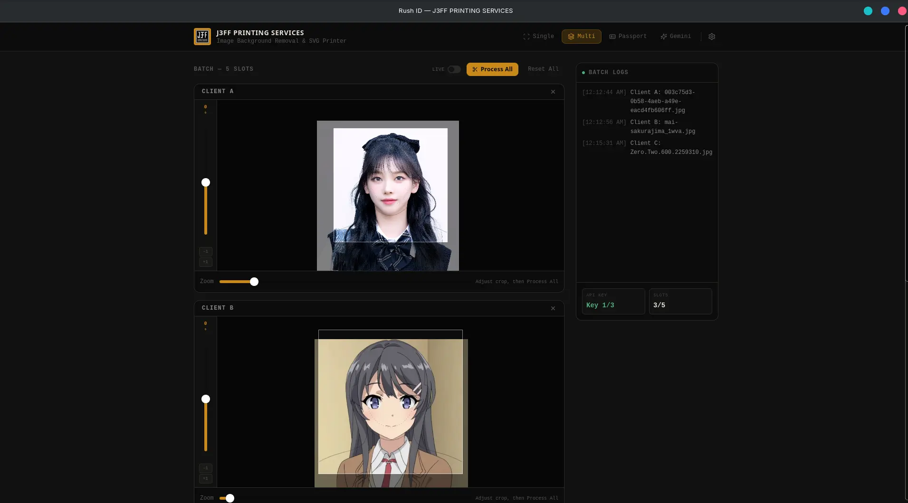
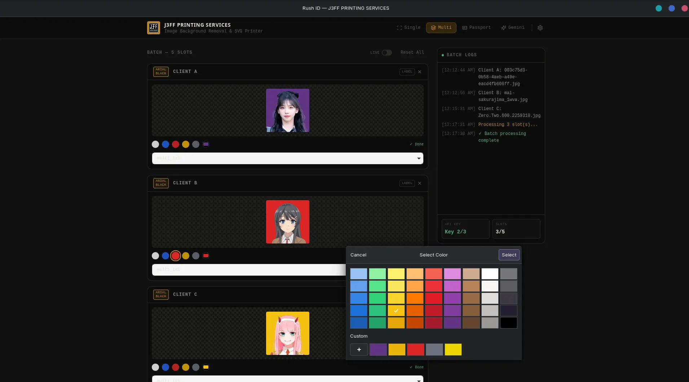
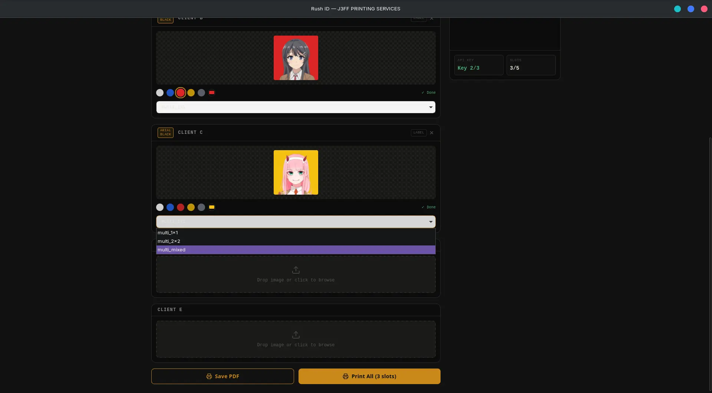
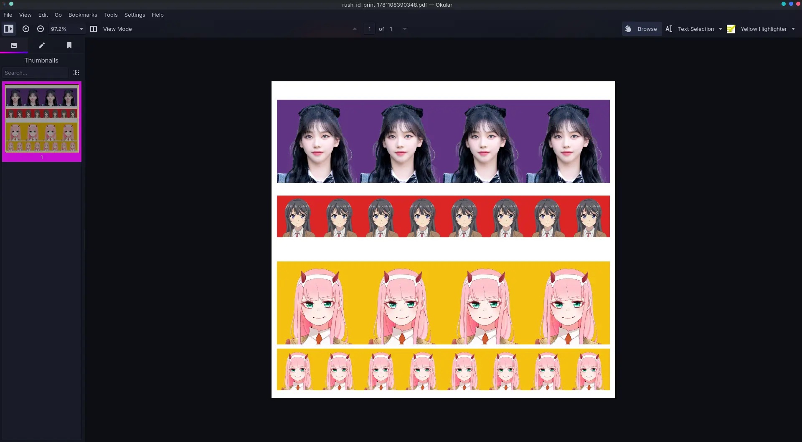

# Rush ID

> Crop, remove backgrounds, and print ID photos. Fast.

[](https://github.com/jrchioco/rush_id_tauri/releases)
[](LICENSE)
[]()

This project is source-available, not open source. See the [LICENSE](LICENSE) file for details.

Crop ID photos, remove backgrounds via remove.bg or poof.bg, overlay onto SVG templates, then print or export PDF. Built with **Tauri v2 + React 19 + TypeScript + Tailwind CSS**.

## What is this?

Rush ID is a desktop app for processing ID photos. Drop in your images, crop them to the right size, remove the background, overlay them onto templates, and export to PDF. It handles batch workflows too, so you can process multiple clients without switching apps.

## Features

### Image Input

- **Drag-and-drop, file picker, or clipboard paste**: whatever's fastest for you
- **1:1 crop** for ID photos and **35x45mm crop** for passport photos
- **Face guide overlay**: helps position the face correctly in the frame
- **Rotation control**: slider, numeric input, or Alt+scroll wheel for fine-tuning

### Background Removal

- **Multi-provider support**: remove.bg (primary) with poof.bg (fallback) for reliability
- **Key rotation**: multiple API keys per provider for higher throughput
- **Background color picker**: White, Blue, Red, Yellow, Gray, or custom hex

### Templates & Export

- **SVG template selection**: 1x1, 2x2, Mixed, passport, and Polaroid layouts
- **Batch processing**: up to 5 clients simultaneously
- **PDF export**: pure Rust rendering via svg2pdf, no external dependencies
- **Print via OS dialog**: opens PDF, you press Ctrl+P

### Editing

- **Retouch window**: clone stamp, eraser, brightness and contrast adjustments
- **Name & signature overlay**: 4 fonts, 3 label modes (Off, Name, Name+Sig)
- **Rotation control**: slider, numeric input, or Alt+scroll wheel

### Workflow

- **Test mode**: toggle between live API calls and test mode for pre-cleared photos
- **Tab switch confirmation**: warns if you have unsaved work before switching
- **Auto-updater**: silent install with signed releases
- **Settings modal**: manage API keys from within the app

## Tabs

| Tab | Description |
|---|---|
| **Single** | Process one photo at a time |
| **Multi** | Batch workflow with up to 5 clients (1:1 ID photos) |
| **Passport** | Batch workflow with up to 5 clients (35x45mm passport photos) |
| **Polaroid** | Load photos into Polaroid-frame slots, reposition, rotate, export to PDF |
| **Gemini** | AI image generation (coming soon) |

## Screenshots






## Prerequisites

- **Windows 10+** (WebView2 pre-installed) or **Linux** (Debian/Ubuntu)
- A **remove.bg** or **poof.bg** API key

## Installation

Download the latest installer from the [Releases](https://github.com/jrchioco/rush_id_tauri/releases) page.

| Platform | Format |
|---|---|
| Windows | `.msi` installer |
| Linux | `.deb` package |

On first launch, you'll be prompted to enter your remove.bg or poof.bg API key(s). Everything else is auto-configured.

## Development

```bash
git clone https://github.com/jrchioco/rush_id_tauri.git
cd rush_id_tauri
npm install
npm run tauri dev
```

## Production Build

```bash
npm run tauri build
```

Produces `.msi` (Windows) and `.deb` (Linux) in `src-tauri/target/release/bundle/`.

For signed builds (required for auto-updater), set the signing key and password as env vars before building (ask the team for the password).

## Release

Tag a version to trigger the CI/CD pipeline:

```bash
git tag v1.15.0
git push origin v1.15.0
```

This builds, signs, creates a GitHub Release, and uploads the installers + update manifest.

## Tech Stack

| Layer | Technology |
|---|---|
| Frontend | React 19, TypeScript, Tailwind CSS, Vite |
| Backend | Rust, Tauri v2 |
| Crop | react-easy-crop |
| Icons | lucide-react |
| Notifications | sonner |
| API | remove.bg / poof.bg (multipart POST) |
| PDF / Print | svg2pdf (pure Rust) |
